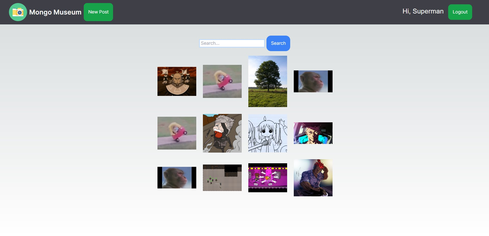
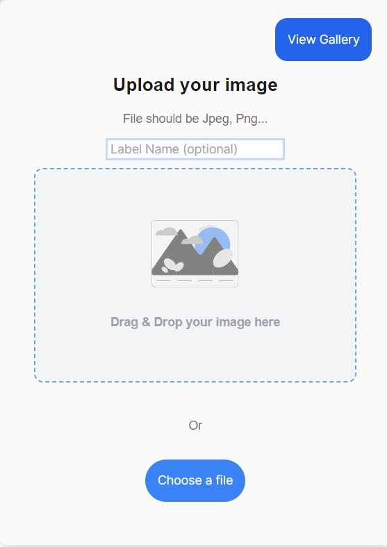
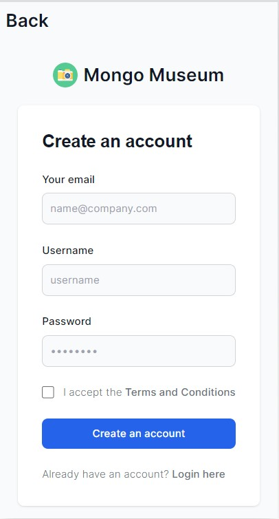

<!-- Please update value in the {}  -->

<h1 align="center">Mongo Museum</h1>

<div align="center">
  <h3>
    <a href="https://museum-frontend-eight.vercel.app/">
      Demo
    </a>
  </h3>
</div>

<!-- TABLE OF CONTENTS -->

## Table of Contents

- [Overview](#overview)
  - [Built With](#built-with)
- [Features](#features)
- [How to use](#how-to-use)

<!-- OVERVIEW -->

## Overview





This is a fullstack image-hosting and sharing project. I built the backend with custom RESTful API to handle CRUD functions. I used MongoDB Atlas to store images and users in a cloud, and used Axios to create, read, update, and delete these images and users. For the client, I used Next.js for setup, React.js for the website, and used Tailwind for styling. I deployed the backend using Render, and the frontend using Vercel.

Problems/Solved: I could not get functions to run after an Axios request, then I realized I had to send a res.status back from the server.
Search would not work when search is invalid, then valid, so temp fix added.
Needed to add buttons to flip between upload and gallery, so I had to set states/terniary operators for final screen if user uploaded or not. And one of the hardest parts was deploying the project. It was hard to decide but I ended up choosing to deploy the backend on Render as a web service, and frontend on Vercel. Mainly since it was what worked fastest.

### Built With

<!-- This section should list any major frameworks that you built your project using. Here are a few examples.-->
- [MongoDB](https://www.mongodb.com/)
- [Express](https://expressjs.com/)
- [React](https://reactjs.org/)
- [Next.js](https://nextjs.org/)
- [Tailwind](https://tailwindcss.com/)
- [Cloudinary](https://cloudinary.com/)

## Features

The user can upload an image with a label by either drag and dropping a file, or by selecting a file through the button. Or, the user can just immediately view the gallery. After an image is uploaded there is a loading screen, then the user gets the image back along with a sharable link to the image. Their image is displayed in the gallery along with every other image in the database. **Users can also search** for a particular label to view only images with those labels. Images can be deleted, have their labels changed, or have their links copied by users. 

## How To Use

Either use the demo link or locally. Clone and run this application, you'll need [Git](https://git-scm.com) and [Node.js](https://nodejs.org/en/download/) (which comes with [npm](http://npmjs.com)) installed on your computer. From your command line:

```bash
# Clone this repository
$ git clone [https://github.com/your-user-name/your-project-name](https://github.com/gabrielyap/mongo-museum)

# Install dependencies
$ npm install

# If local run the server and change axios addresses (optional)
$ cd backend/npm run dev

# Run the app
$ npm run dev

# Might have to restart the Render server every once in a while.

```
