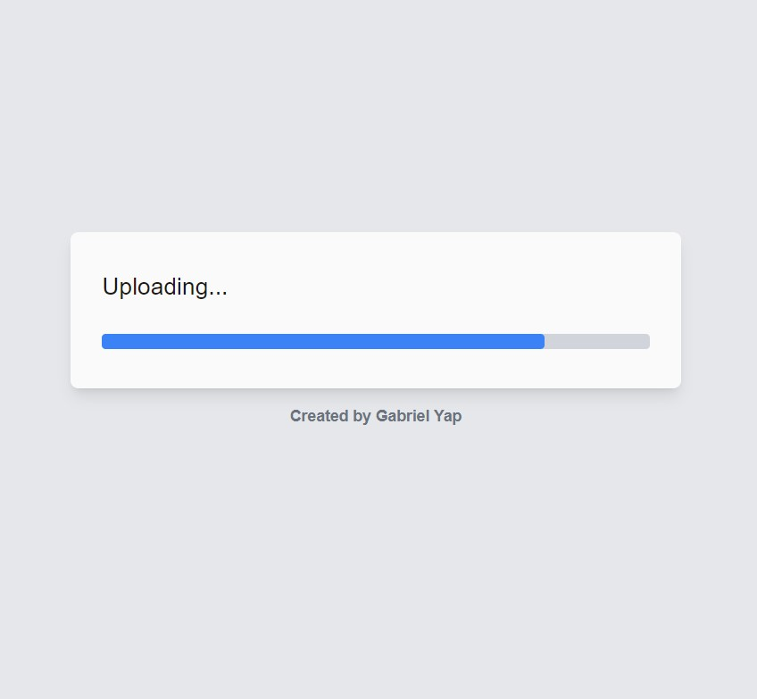
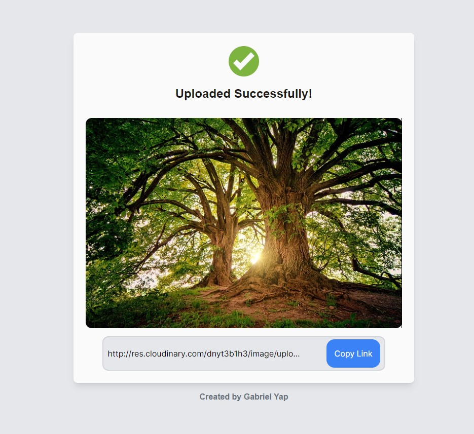

<!-- Please update value in the {}  -->

<h1 align="center">Mongo Museum</h1>

<div align="center">
   Solution for a challenge from  <a href="http://devchallenges.io" target="_blank">Devchallenges.io</a>.
</div>

<div align="center">
  <h3>
    <a href="https://image-uploader-k2jeyzelc-gabrielyap.vercel.app/">
      Demo
    </a>
  </h3>
</div>

<!-- TABLE OF CONTENTS -->

## Table of Contents

- [Overview](#overview)
  - [Built With](#built-with)
- [Features](#features)
- [How to use](#how-to-use)

<!-- OVERVIEW -->

## Overview





The project is available through the demo link above. I learned a lot about how to use Next.js to start a React project, as well as how to use Tailwind to stylize components. Also, I learned more about Axios and how I can use it to send requests to Cloudinary.

Problems/Solved: I could not get functions to run after an Axios request, then I realized I had to send a res.status back from the server.
Search would not work when search is invalid, then valid. Have to reset.
Needed to add buttons to flip between upload and gallery. Had to set states/terniary operators for final screen if user uploaded or not.

### Built With

<!-- This section should list any major frameworks that you built your project using. Here are a few examples.-->

- [React](https://reactjs.org/)
- [Next.js](https://nextjs.org/)
- [Tailwind](https://tailwindcss.com/)
- [Cloudinary](https://cloudinary.com/)

## Features

The user can upload an image by either drag and dropping a file, or by selecting a file through the button. After the image is sent to Cloudinary, the user gets a link to the hosted image.

## How To Use

To clone and run this application, you'll need [Git](https://git-scm.com) and [Node.js](https://nodejs.org/en/download/) (which comes with [npm](http://npmjs.com)) installed on your computer. From your command line:

```bash
# Clone this repository
$ git clone [https://github.com/your-user-name/your-project-name](https://github.com/gabrielyap/image-uploader)

# Install dependencies
$ npm install

# Run the app
$ npm run dev
```
